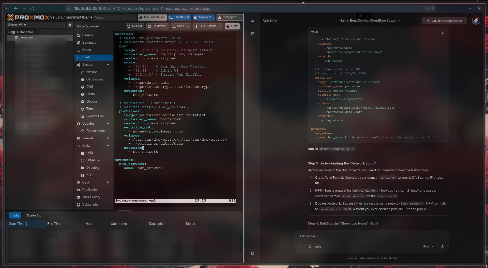
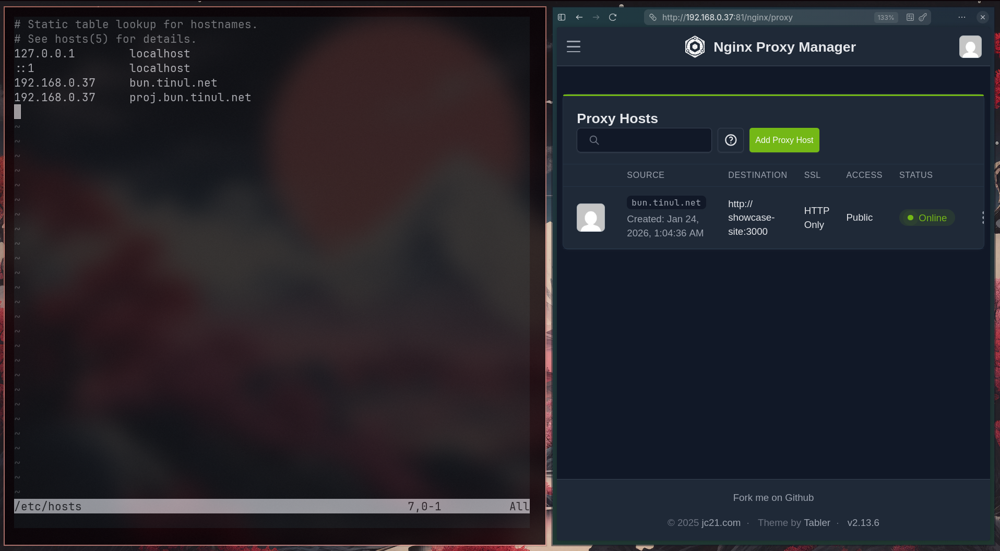
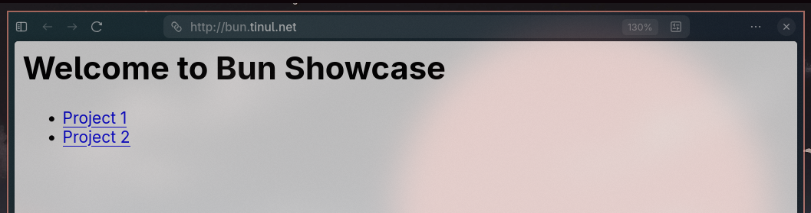
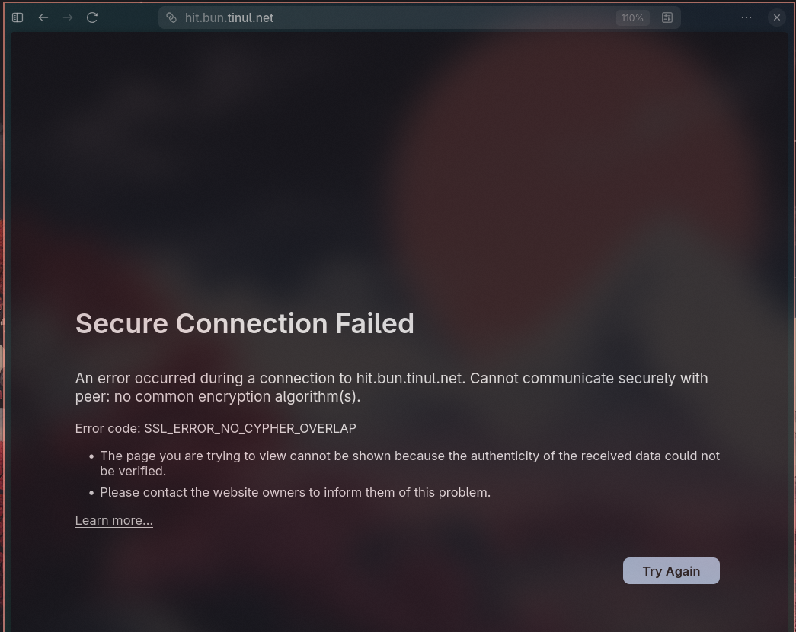
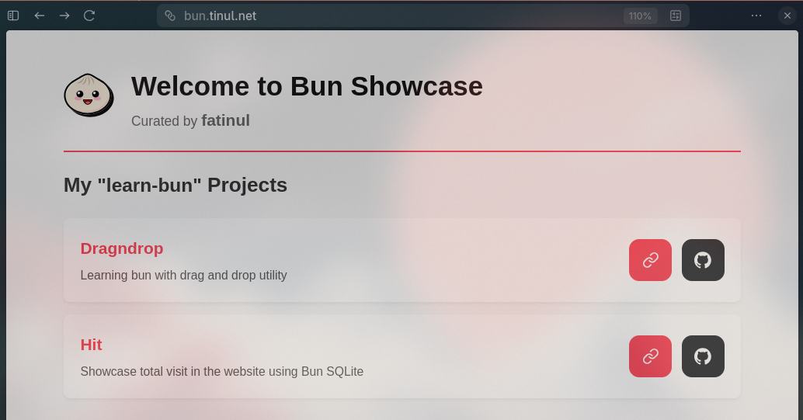
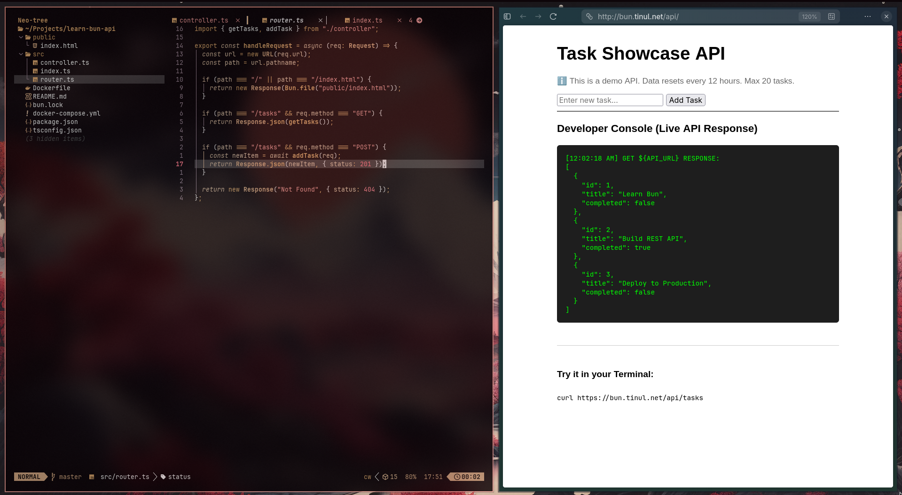
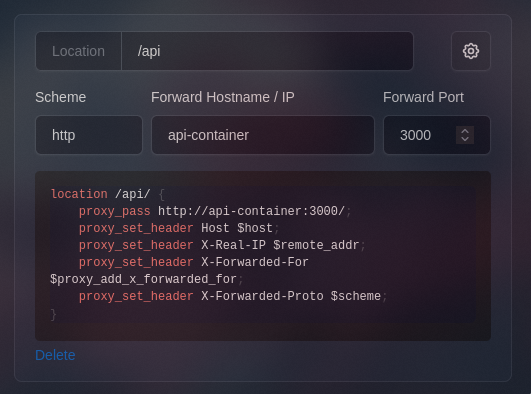

> DISCLAIMER: I am trying with a new appraoch to blogging, this team I want to be more in catalogue (everything in here was written during my discovery w/ some touchup)

Learn to make nginx proxy manager to handle redirect and portainer to handle dockers. Trying to make a docker-compose that will setup both in one go.

Testing if the redirection/receiving end of Nginx works perfectly before create a Cloudflare Tunnel. I am using /etc/hosts/ to create  only my laptop known DNS to test with ip reaching. Fortunately, it **does not** (more reading/learning).

> As you can see during the early build, I am trying to make use of nested subdomain, however it is quite overcomplicated and look not so much projessional `(ie. this-project.bun.tinul.net)`

After some troubleshooting, I finally can open the Bun showcase. However, I am using fake hostname: http://show.bun.net which is just use for testing. Now seeing that it works, I want to use the Cloudflare tunnel with the real https://bun.tinul.net

There are some errors in CLoudflare Tunnel. After checking with the docs, there is an exisitng DNS bun record at Cloudflare (due to my previous attempt), So, I just delete the DNS record and I can access the bun showcase using https://bun.tinul.net **(FORESHADOW: I scrap this idea)**

Now I want to access using hit.bun.tinul.net, it works after add the hit.bun.tinul.net manually in the Cloudflare tunnel. However, it is not support HTTPS (SSL). To open cloudflare everytime new project is not the best case right now..

Now it has support the Let's Encrypt after I check the nginx-package-manager error log, and realised that I use fake email - admin@example.com, which is **red flag**. After change to my personal email that also link to cloudflare, I got the SSL certificate. The issue is that I need to use my API token to get the DNS Challenge from Nginx.

Even though I got the SSL Let's Encrypt certificate **(learn a lot about SSL)**, change every possible settings in Cloudflare. I change the approach and uses path (a much easier) way. So I basically will redirect user as Nginx have an option to set a custom location ie bun.tinul.net/hit and instead of requiring an individual SSL certificate, it uses the already configured SSL by `*.tinul.net` by Cloudflare.

## Learn Concept
- Docker network: Essentially an special ip-address that are created by docker compose (or can create easily with ` docker network create ..`) to easily communicate between each other using a name instead of ip address number
- Wildcard: essentially like a `**kwargs` in python where any nested subdomain can live and created modularly, not in a sense hardcoded subdomain in application route. However, I believe it is beyond the scope of free Cloudflare Tunnel account
- Setup local DNS so that I would not need to manually find the exact ip address. 
	- Use `sudo nvim /etc/hosts` and then simply add the ip address + dns (local) once and forget about it (until I change the ip address of the server hihi)

Create a better visual represnetaion

> see the url changes

I got some issues with github webhook and portainer as its not rebuild my site automatically. I believe there might be some mistake, however this is a manual `docker compose up -d --build` 

Solve this using docker git polling (set to 10minute) instead of webhook as my portainer is just local.

Now a problem arise for adding another site. - learn-bun-dragndrop

`docker exec -it nginx-proxy-manager curl http://dragndrop:3000`

The dragndrop can be retrieve but it is empty for some reason, may be need to edit the page pathing. Okay the issue got resolved after let the vite to find the src folder not in the root folder but instead dragndrop/ folder. 

After some troubleshooting, I finally decided to let go the project since it was built when I did not have nginx and portainer in mind hence it is quite sluggish when try to implement them.

So I start a new project with a much2 simpler - REST api. The reason I choose this project is because of simplicity and it require some path fixes that almost similar with dragndrop but with a much smaller backend complexity.

I also encounter the same issue as in dragndrop which is the confusing pathing route. I have been using Gemini and I think it just becomes a loop where it still cannot solve the issue. With a new breath of air, I tried Claude. Never using it but I heard it was good. So I clearly my problem and progress. And with just 1 prompt, the issue got fixed.

It said to add this and change the api fetching in the code which is more than what the gemini suggest. I learn many new concepts during the troubleshooting and I dont regret spending hours to get this site down. The benefit will starts later when I have a new changes and everythign will just automatically update.  

Thank you for reading my blog aka catalogue.
