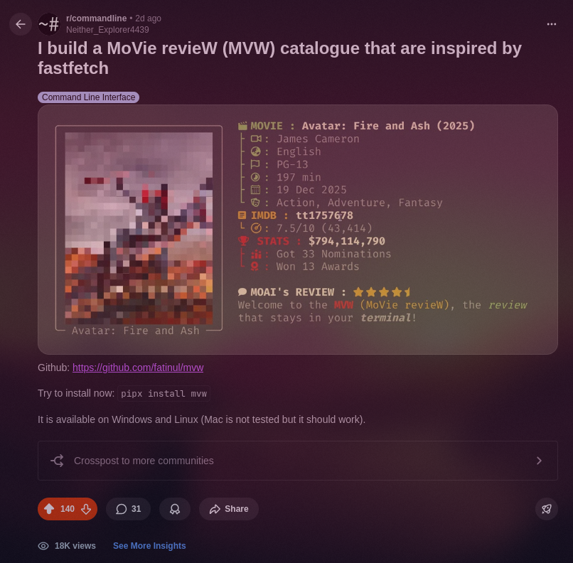
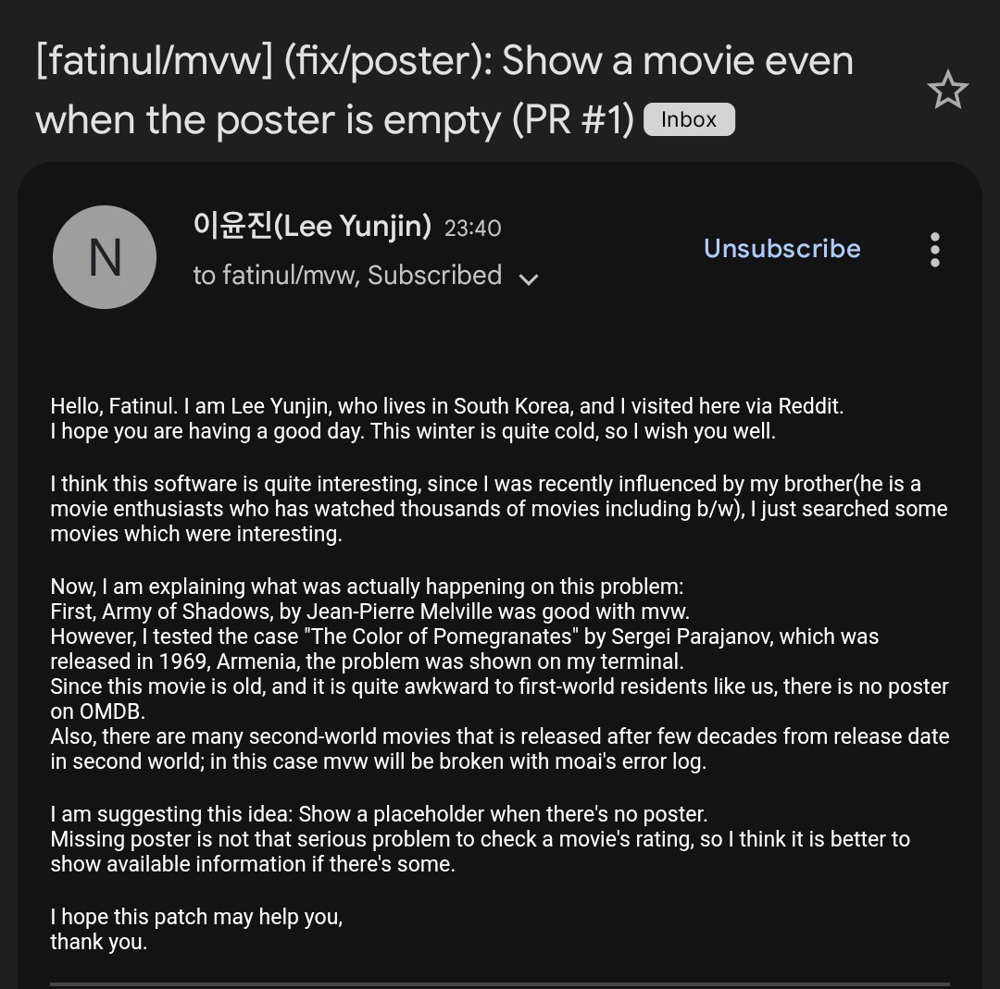
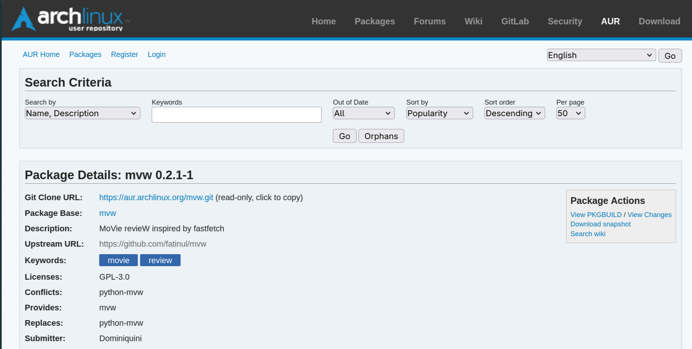

<details>
<summary>🗺️ Table Map</summary>

- [How it all started?](#how-it-all-started)
- [The Turn-of-event](#the-turn-of-event)
- [Sharing on Reddit](#sharing-on-reddit)
- [What happen to my Github repo?](#what-happen-to-my-github-repo)
  - [Pull Request](pull-request)
  - [Contributions](#contributions)
  - [Managing my Repo](#managing-my-repo)
  - [AUR](#aur)
- [What I learned?](#what-i-learned)

</details>

---

> **NOTE:** For the context, this blog is about my [Movie Review project](https://fa.tinul.net/projects/mvw)

## How it all started?

It was started because I am in the phase of just graduated.

Wanted to make something in my free time that I could use. So I am determined to build a ... 

```
TUI + MOVIE = AMAZING IDEA
```

In the early build it was supposed to check every movie that I have in the specified directory **~/Videos**
Then display and let user simply play the movie.

The project itself have 3 names **(mvtinul -> mvp -> mvw (latest))**

It was almost complete but ...

## The Turn-of-event

I cannot sleep. Lying in my bed thinking

```
"Has anyone ever make a TUI + movie before?"
```
Then, I was **stunned** ... 

There are number of projects that have already established, stable like a rock just sitting there in the night sky with **hundreds of star** in Github.

There was no chance in any universe that my small projects can fight with the behemoth of projects that have *thousands of contributions and features*.

I don't want to give up ... I have spent plenty of my time in this project. 

Then I pull a **trigger**, I am remaking my project with a fresh idea.

That was the moment that I remembered about my *movie catalogue* that I made in Obsidian weeks prior. Then I got an idea ...

```
What if I make a movie review post?!
```

Inspired by [letterboxd](https://letterboxd.com/) and [fastfetch](https://github.com/fastfetch-cli/fastfetch), I start to create a note in *obsidian* about my idea. 

It just felt so **right**, I was in my flow state.


Next day, I started from scratch, delete my repo and start fresh. I already know the system, I just need to tweak it a bit.

### TMDB vs OMDB API

During **mvtinul** era, I use *TMDB*, it was reliable, have many metadata that I want but the **registration** are quite too specific. 

```
They "ask where you live"
```

I have already doubted to even implement an API since it will create friction for users, *not to mention* - Giving my address to a sketchy site that I never heard of ... ermm thank you)

After some research, I found another API site for movie, it is free (same to TMDB) but..

```
It only require my email?! (SIGN ME UP!!)
```
Then, I immediately change my entire database to accommodate for the new **OMDB API**.

## Sharing on Reddit

After days, my project have reached the MVP stage. Finally, I pushed my Git into the Github (with a huge confidence)

In the early hours, I was feeling a little disappointed knowing that my project is *not the best idea or groundbreaking* invention humans ever seen. 

If the project failed to get some traction, I am planning to add a **true-search feature** and just calls it a day. However..

```
The Project BLEW UP! (*according to my standard)
```

It starts small, one comment and some upvotes, later it slowly but surely grew out of hand. Comments came from out of nowhere to compliment my project.

[This is the reddit post link](https://www.reddit.com/r/commandline/comments/1q2sb6a/i_build_a_movie_review_mvw_catalogue_that_are/?utm_source=share&utm_medium=web3x&utm_name=web3xcss&utm_term=1&utm_content=share_button)


It was something that I never think it will happen especially in the [command line](https://www.reddit.com/r/commandline/) community in reddit ... but it did.

## What happen to my Github repo?

With the viral content, there should something in return right?


There it is, the **stars**, it is my personal record for a project. 

Of course, it is not that huge but the people that stars often the people that used my project and want to see the progress. 

```
I feel motivated!
```

### Pull Request

With the stars, come the pull request. 

I have never expecting anyone to even pull request in my small code but there it is!



It was a little bit nerve wracking and I learned a lot on how to handle pull requests even in a short moment.

### Contributions

There are at the time posting, 2 contributors on my project:
- The first one is the email: **Fixing Poster Missing error**
- The second one: **Improving the poster rendering**

Both contributions really nail down the features that I want to fix and improve and huge thank you for both of them.

### Managing my Repo

I use everything that Github offers in terms of managing the repo:
- **Github Actions**: Automatically test and Build my package to PyPI.org
- **Issues**: To keep track with everything regarding bug and new features
- **Github CLI**: One if not the most performance way to do anything github (really recommend it!)

### AUR

One of the most unexpected surprise was there was ...

```
Someone maintain my project in the AUR!?
```

I have never met or know him but truly a savior for me.

[This is the AUR link](https://aur.archlinux.org/packages/mvw)



## What I learned?

### 1. Ideas don't have to be "Unique" to be "Valuable"

I almost quit because other movie TUIs existed. I learned that execution and *niche* matter more than being *first*.

My project wasn't just a player; it was a personal movie catalogue inspired by Letterboxd. 

```
That specific "flavor" is what resonated with people.
```

### 2. The Power of "Building in Public"

If I had kept the code on my local machine because I was "stunned" by the competition, none of this would have happened. 

Sharing it on Reddit even when I felt it wasn't "groundbreaking" opened doors to ...

- **External Validation**: Realizing people actually wanted this.
- **Contributors**: People fixed bugs I hadn't even noticed yet!
- **Community Support**: Someone I don't even know is maintaining the AUR package for me.

### 3. Friction is the Enemy of Adoption

Choosing OMDB over TMDB was also a turning point. 

By reducing the "friction" (not asking for a home address), I made it easier for people to actually run the code. 

```
In software, user privacy and easy setup are features.
```

### 4. Open Source is a Conversation

Managing a repo isn't just about writing code ... 

```
It's about communication
```

Learning to handle Pull Requests and using Issues to track features ... 

> Turned my **"solo project"** into a **"community project."**

Checkout the [mvw](https://github.com/fatinul/mvw) now and don't forget to star and give feedbacks!
