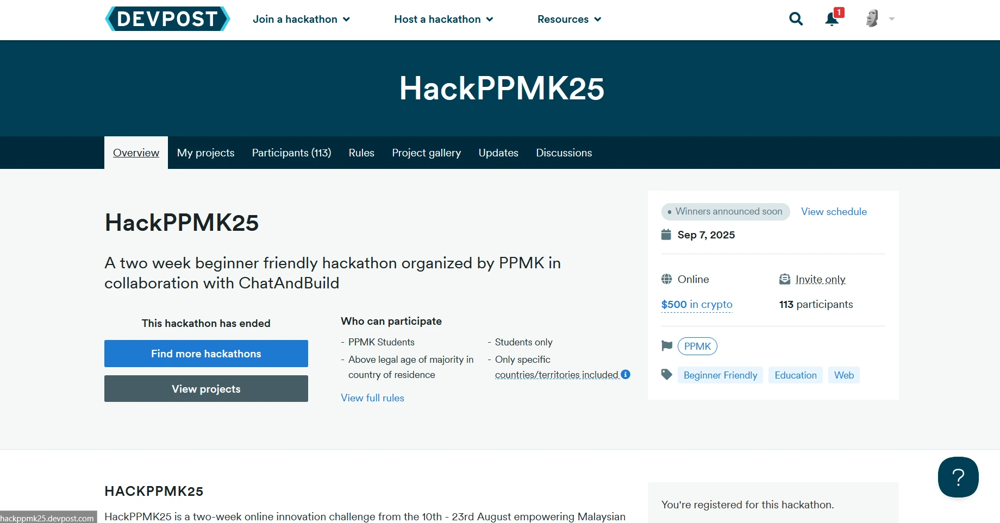
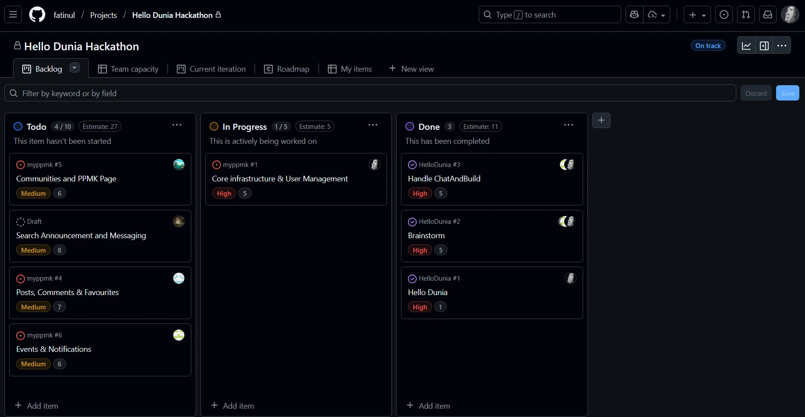
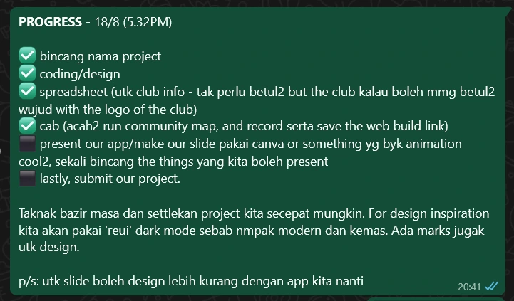

You can check my project [here](http://fa.tinul.net/projects/myppmk)

🗺️ Table Map

- [The Birth of a Hackathon Idea](#the-birth-of-a-hackathon-idea)
- [My First Taste of Leadership... and Chaos](#my-first-taste-of-leadership-and-chaos)
- [The Pivot: Finding Simplicity in the Mayhem](#the-pivot-finding-simplicity-in-the-mayhem)
  - [Before](#before)
  - [After](#after)
- [What I Carried Out of the Arena](#what-i-carried-out-of-the-arena)

---

# The Birth of a Hackathon Idea

It all started with the [HackPPMK '25 event](https://hackppmk25.devpost.com/). The theme was a mouthful: **"Enhancing digital connectivity between student communities."** Our minds immediately went to building a whole social media universe just for PPMK members. Grand, right? Maybe a little *too* grand for a two-week deadline. We quickly realized we'd bitten off more than we could chew. (**Foreshadows**: Everyone do the same idea)

So, we hit the reset button. Instead of building a digital behemoth, we asked ourselves, "What's a fun, simple way to show connections?" That's when the lightbulb went off: a **mind ma**p! We pictured something like Obsidian's graph view, where you could click on nodes to explore different clubs and see the web of relationships connecting them. Simple, visual, and way more achievable.

# My First Taste of Leadership... and Chaos
So, there I was, leading team "**HelloDunia**" in my very first hackathon. I guess I got the gig for being the *nerdiest* one (a title I wear with pride, lol). But let me tell you, leading a team through a two-week project crunch is a whole different ball game.

The first week was, in a word, a **disaster**. We were trying to juggle a bunch of new tools and workflows. We were supposed to use a sponsored app called ChatAndBuild, which relied on "vibe coding" – a bit too abstract for my taste when the clock is ticking. We flirted with Figma, but our design skills were... let's just say "a work in progress."

I tried to be a *good* leader and set up a fancy Kanban board on Github Projects. It looked **professional**, but in reality, it just **slowed us down**. Most of my team wasn't used to GitHub, and it turned our workflow into a tangled mess. On top of that, we were all juggling internships and vacations (yep, including me). It felt like we were trying to build a rocket ship with one hand tied behind our backs.

# The Pivot: Finding Simplicity in the Mayhem
After a week of spinning our wheels, we threw our initial, overly complicated plan out the window. That's how the MyPPMK mind map was born – simple, creative, and free of unnecessary fluff.

I ditched the fancy Github project board and switched to... **WhatsApp**. Yep, a simple checklist with ⬜ and ✅ emojis became our command center. It was low-tech, but it worked beautifully.

## Before

## After
*Much more demure*

I also changed my leadership style. Instead of ask opinions and wait, I started assigning tasks directly, playing to my teammates' strengths. I paired up friends to work together and made my instructions crystal clear: here's the task, here's a simple description, and here's the deadline. No more bottlenecks, just pure, unadulterated progress.

# What I Carried Out of the Arena
My biggest takeaway from this whole experience can be summed up in one beautiful acronym: **KISS** (Keep It Simple, Stupid). From the project idea to the tools we used, simplicity was the key to our success. We didn't need fancy tools like Figma or Github Projects to get the job done.

I also learned the importance of knowing your team. Our strength was our bond; we were already friends, so there was no awkwardness. Our weakness was our unfamiliarity with certain tools and our crazy schedules. By embracing our strengths and working around our weaknesses, we were able to cross the finish line. It turns out, you don't need rigid meetings and complex workflows when you have a great team and a simple plan.