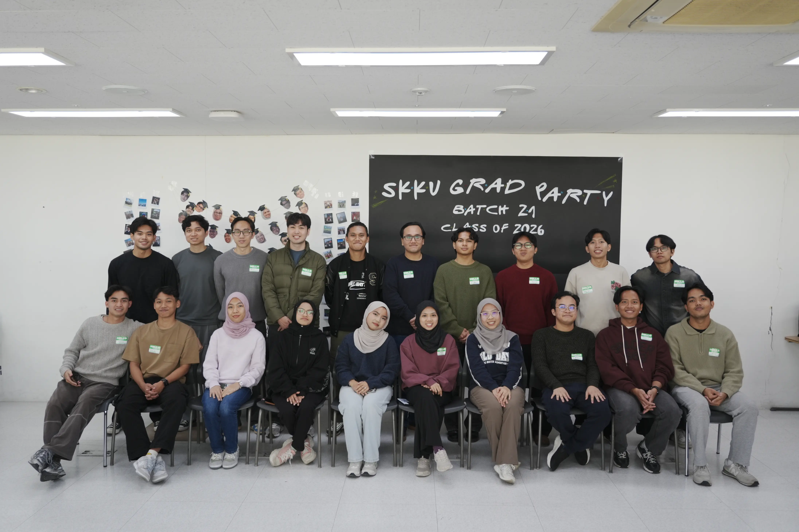
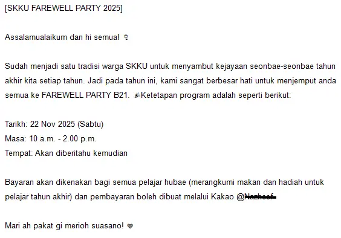
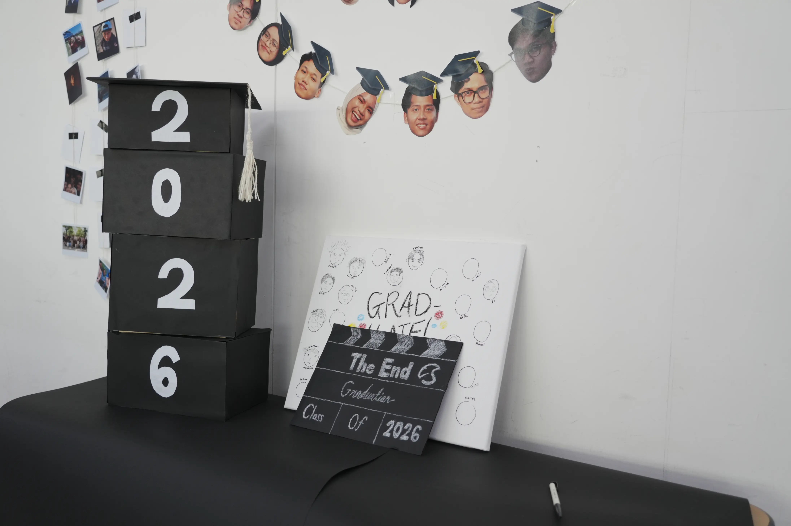
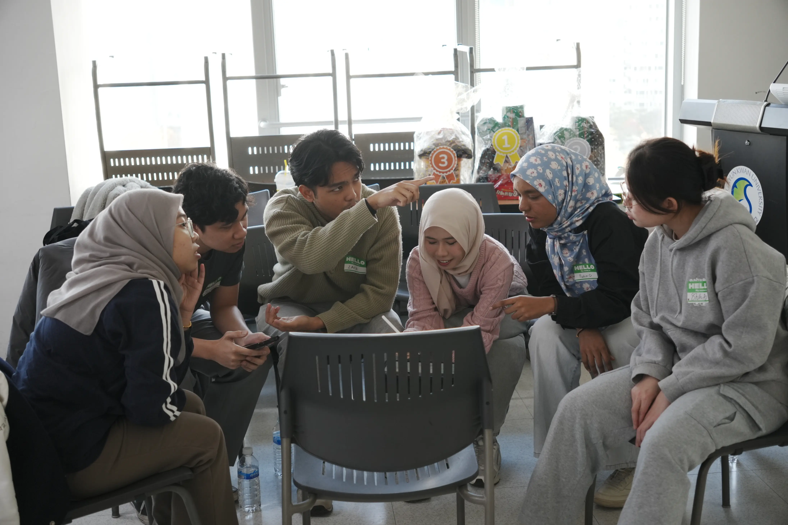
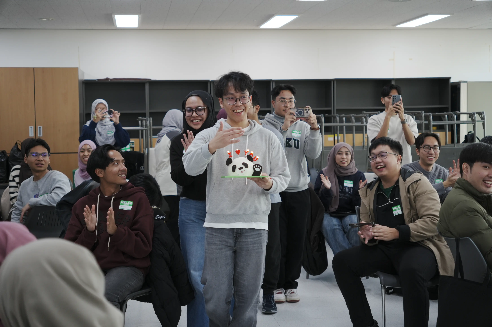
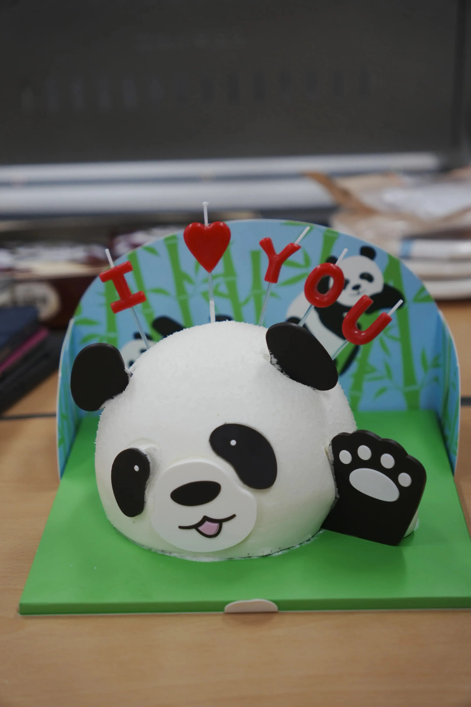

🗺️ Table Map

- [💨📖 The Story](#-the-story)
  - [✉️ The Invitation](#️-the-invitation)
  - [🖼️😎 The Decoration](#️-the-decoration)
  - [🎲🎮 The MiniGames](#-the-minigames)
  - [🗣️🔈 The Talk](#️-the-talk)
  - [🎂🍰🐼💥 The Surprise!!! 💥🐼🍰🎂](#-the-surprise-)
  - [👋 The Finale](#-the-finale)

---

## 💨📖 The Story

> Note: This is the details from my [Farewell Party post](https://www.linkedin.com/posts/fatinul_skku-highereducation-studentlife-ugcPost-7398232140280176640-4Rzh?utm_source=share&utm_medium=member_desktop&rcm=ACoAAFeETwYBXjMReQzAGctIOR1xyeRjw0dI-QI) on my Linkedin

💭 "*It still felt like yesterday*"

The SKKU final year farewell party wasn't just an *on-surface* event.. it was a potent **reminder** of all the late nights, the **challenges**, and the incredible **friendships** forged within these walls. From the initial surprise invitation to the end of the event, all was a truly memorable experience that I would not forget anytime soon. Now, let me tell you a story on how it all begins..

### ✉️ The Invitation

It all started with a curious little invitation from our juniors in our KakaoTalk group (even though we already knew that it's coming (*its literally the **SKKU's tradition***)). I genuinely almost missed it tbh (**foreshadow**: I also forget that it was also my *birthday*). It was Saturday morning (the day that I should be rotten in bed lol). Nevertheless, it was also a gentle reminder that the time is like your moustache (assuming you are a *male*, if you not *focus* on it, it will suddenly grow *out of nowhere*). I still remember the first time we stepped onto campus (not knowing exactly what will happen to us, yet here we are). The initial disorientation (my *morning* brain) quickly dissolved as we gathered, a slightly *bewildered* group (**GROUP 1 for the WIN!**), ready for whatever the *morning* held.

### 🖼️😎 The Decoration

The first thing we encountered was a wall plastered with **photos**: snapshots of us, silly selfies, and those awkward moments we’d all come to cherish. It was a fantastic visual representation of our journey, a tangible reminder of how far we’d come. Then came a small yet powerful task: we were asked to **draw** *our faces* onto a canvas. Let’s be honest, my artistic skills are *not* that good (hehe). I managed to draw a simple *chibi* to represent me. It was a lighthearted moment, a chance to inject a bit of **playful chaos** into the *already* buzzing atmosphere.

### 🎲🎮 The MiniGames

💭 "*This is where differentiate man and a boy*"

As for every year, this was the moment that we were all *waiting* for. We started with:
1. **Suwon Geoguessr**: a brilliant minigame that tested our knowledge of Suwon (it was an *improvement* from last years game that my batch handled *as* it incorporate a simple coding & a larger map area). The competition was *fierce*, with everyone desperately trying to pinpoint the location of each image. 
2. Then came the **Draw a Proverb and Guess** challenge. This was utterly chaotic, with a flurry of scribbled lines and wildly imaginative interpretations. It was all started as a simple proverbs like '*bagai kera mendapat bunga*', then it all went down in '*kalau menyeluk pekasam, biar smapai ke pangkal lengan*'. These *proverbs* combined with our *5 years from SPM*, the outcome has already been decided. Nevertheless, it was a  hilarious game that *literally* break the ice for us.
3.  Finally, **the Emoji Guess**: a surprisingly tricky test of our collective mind to guess the *things* that the emojis represent. We were laughing, strategizing, and generally just having a *ridiculously good time*.

### 🗣️🔈 The Talk

After the games, we had a brief but *important speech* from the our batch's representatives of **MARA** and **JPA**. It was a genuinely appreciated moment, a *formal* recognition of the *hard work* and *dedication* that we’d invested in our studies.

### 🎂🍰🐼💥 The Surprise!!! 💥🐼🍰🎂

💭 "*How did they plan this?*"

But the biggest surprise, and undoubtedly the most *cherished* moment of the evening, was the **surprise BIRTHDAY celebration**. Fahrul and my partner (Azmeera) had been working *behind the scenes* to organize it. The fact that I completely **forget** that it was my own birthday just make me so much more surprise. Seeing the look on everyone's faces was incredible as this is my *first* and presumably my *last*. The **panda cake** and a bag of chips, it was so **cute** (shoutout for Azmeera for buy it for me!), it felt incredibly thoughtful and **special**. The warmth of the room, the genuine smiles, and the feeling of being surrounded by people who genuinely cared.. it was **overwhelming**.

A **quick photo capture** followed (one of them is at the top of this blog), capturing the slightly *disbelieving* joy on our faces. And then, the moment we'd all been **waiting for**: the **FOOD**! Bella Tunisia’s tagine chicken was absolutely incredible. They are rich, flavorful, and a *perfect* end to the games and laughter. To top it off, @Qawi (CEO of Business) had thoughtfully designed a the backdrop of a framed Lego minifigure (need to mentioned since he said it took him 3 laptop restart to get this into our hand). It was a *wonderfully* quirky and personal touch.

### 👋 The Finale

As the evening drew to a close, I felt a *profound* sense of gratitude. It wasn’t just about the food, the games, or the gifts.. It was about the **connections** we’d made, the **memories** we’d created, and the shared **experiences** that would stay with us long after we’ve *left SKKU*. This farewell party *wasn't* just an ending; it was a *vibrant* celebration of everything we've accomplished, a testament to the power of community, and a beautiful reminder of the friendships that will undoubtedly shape our futures. It was, without a doubt, **a truly unforgettable experience**.

