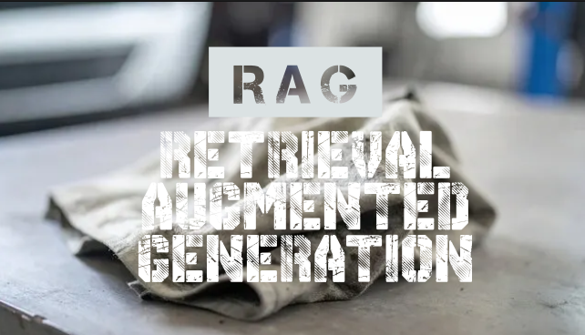

<details>
<summary>🗺️ Table Map</summary>

- [🧻❓ What is RAG?](#-what-is-rag)
- [⚙️ How RAG works in the code?](#️-how-rag-works-in-the-code)
  - [🗃️🔢 STEP 1: Indexing](#️-step-1-indexing)
  - [🔍🕵🏻‍♂️ STEP 2: QUERYING](#️-step-2-querying)
  - [🤖🏭 STEP 3: GENERATION](#-step-3-generation)
- [🤔💡 Why use RAG in the first place?](#-why-use-rag-in-the-first-place)

</details>

---



# 🧻❓ What is RAG?

RAG or in other word **(Retrieval-Augmented Generation)** is a pipeline that extend the capabilities of any Large Language Model (LLM). It is a simple word for "**memory**" that an LLM can refer whenever they want response to a prompt. This fascinating feature is not as hard as it seems. Let me teach you briefly how RAG works using my earlier attempt to create [smartQA](https://github.com/fatinul/smartQA/commit/9d6377d30549d1580d7c8b9e01886f3a949534a3).

# ⚙️ How RAG works in the code?

To put it simply, the whole process can be summarized within **3 simple steps (Indexing, Quering, and Generation)**

## 🗃️🔢 STEP 1: Indexing

Indexing is a step where we will *prep* the data for an efficient retrieval. *It is like prepping our ingredients before cooking (at least in our early days of living alone..)*

In my use case, I use `SimpleDirectoryReader` to load all markdowns file that will be used as our external knowledge. 

```python
# --- RAG Step 1: Index Management (Load or Create) ---
print("Starting RAG Ingestion Pipeline: Building NEW Index...")

# Load documents
loader = SimpleDirectoryReader(
    input_dir=KNOWLEDGE_DIR,
    required_exts=[".md"],
    recursive=True
)
documents = loader.load_data()
```

Then, we will convert our markdown files into the *numerical representation* or also called **embedding** and stored them. This simple step is crucial as it is much easier for computers to compare similar semantics of words according to the thir distances in multi-dimensional space. Just imagine, that closer word meaning, will be closer to each other *literally* when convert to vectors.

```python
ollama_llm = OllamaLLM(model="gemma3:4b", request_timeout=120.0)
ollama_embed_model = OllamaEmbedding(model_name="nomic-embed-text", request_timeout=120.0)

# --- load docs ---

# Create the Vector Store Index
index = VectorStoreIndex.from_documents(
    documents,
    embed_model=ollama_embed_model,
)
```

Since we store the vector inside `VectorStoreIndex`, we can just save it into our persistent storage aka. `./storage` using the script below. Therefore, we would not need to redo everything when we already have done it. Make sense right? 

```python
# Persist the index to disk for future use
index.storage_context.persist(persist_dir=PERSIST_DIR)
```

## 🔍🕵🏻‍♂️ STEP 2: QUERYING

With the persistent storage exist, half of our works are done. Now let's move on to the fun part! 

Okay, this is simply a query to get user's **prompt**. So when user prompt a question, the question itself will be converted into a *numerical representation* similar as before. Make sure that it uses the same embedding model to make it works^^

```python
# --- RAG Step 2: Query Engine Construction ---

# 1. Create the Query Engine (This is fast)
query_engine = index.as_query_engine(
    llm=ollama_llm,
    similarity_top_k=3
)
```

## 🤖🏭 STEP 3: GENERATION

After we got the user's prompt, we will want the system to search the *Vector Store Index* with the closest to the *Query's* embedding. The `similarity_top_k=3` here means, we will want retrieve the top 3 most relevant docs chunks. 

The chunks that we select will then be included in the original user question. You can imagine the prompt to be like this ~

> Using the following context, [Retrieved Docs Chunks]. Answer this [User's prompt].

```python
# --- RAG Step 3: Generate response ---

def ask_rag(question):
    print(f"\n--- Answering Question: {question} ---")
    
    response = query_engine.query(question)
    
    print("\n💡 RAG Answer:")
    print(response.response)

    print("\n📚 Source Nodes:")
    for doc in response.source_nodes:
        print(f" - {doc.node.metadata['file_path']} (Score: {doc.score:.4f})")
```

Finally, we will just simply use LLM to generate the response for us :). (For this use case, we use local LLM: `GEMMA3:4b` model)

# 🤔💡 Why use RAG in the first place?

This might baffled you as you might think ~

> With my powerful mind, why don't I just use the good 'ol "Using the following context, answer this question: [Retrieved Context] Question: [User's Question]". It would be so much better and easier

In a small case, it is much easier to just use that approach. Now, imagine you have hundred of markdown files that you would need to *manually* include in your prompt. That would as easy only if you can find the markdown in one go using `ctrl+F`. Checkmate! That isn't as simple as we thought right?

To put it simply, `RAG` is here to help us find the best context for the job:
1. Find the closest vector distance, 
2. Provide the best semantic context regarding user's prompt, and
3. Give us to have time to relax and drink some "Teh Tarik"