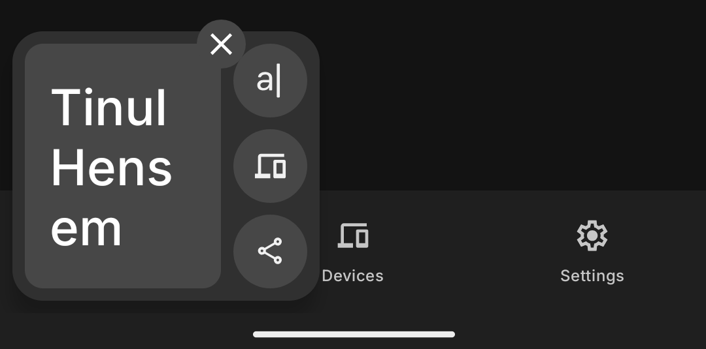
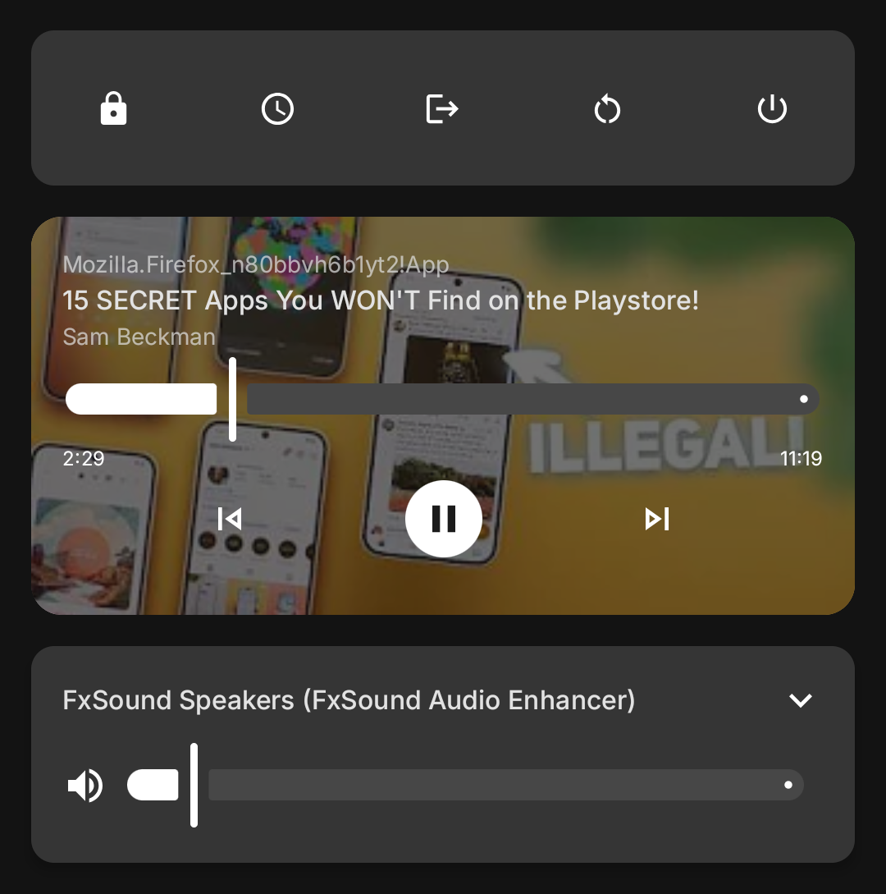
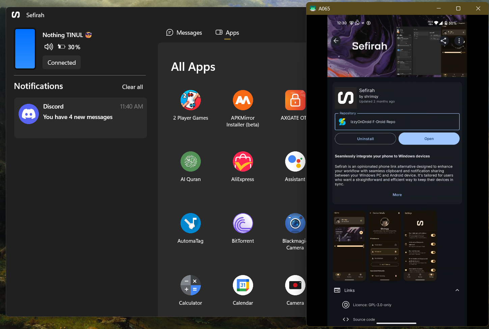
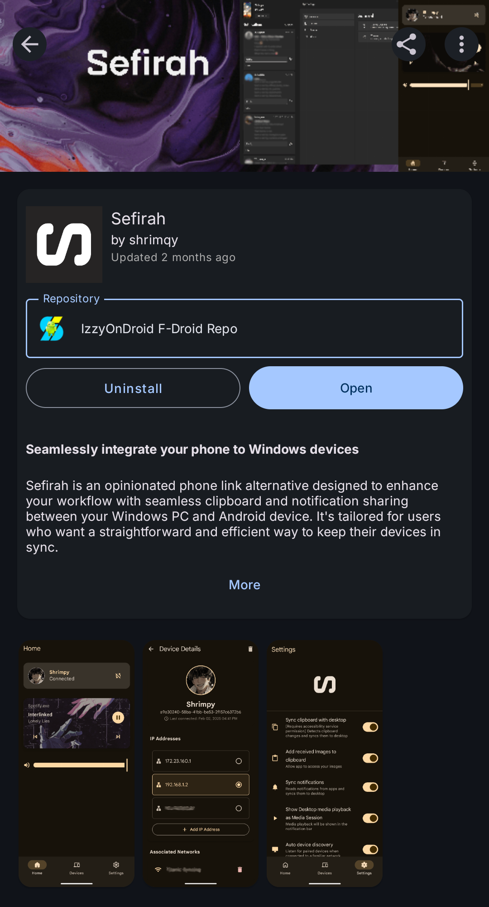
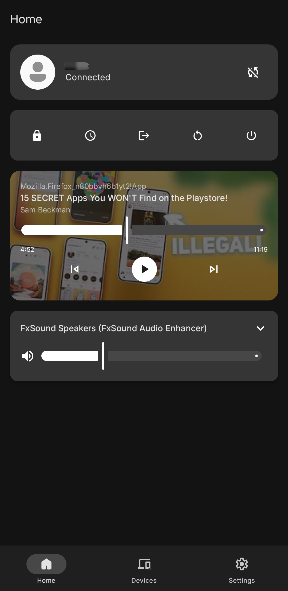
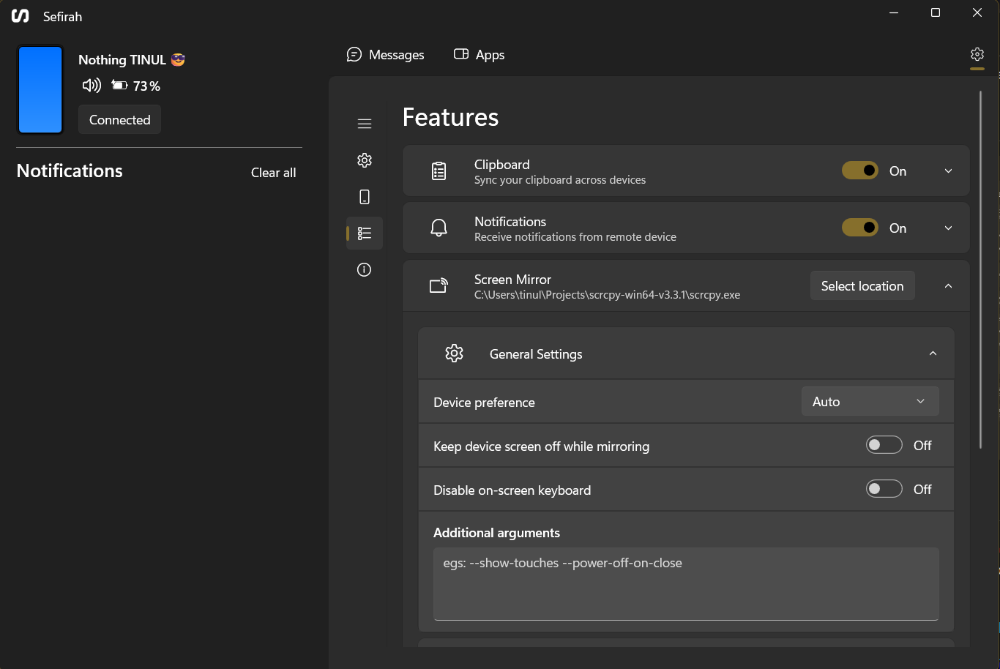
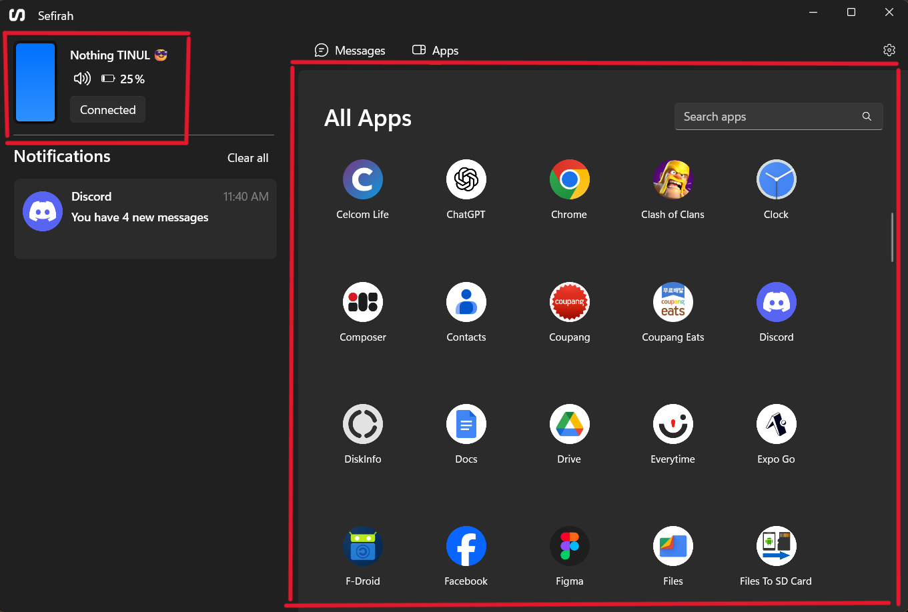
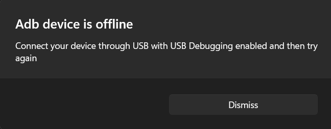

<details>
<summary>🗺️ Table Map</summary>

- [**❓ How I find this app**](#-how-i-find-this-app)
- [**⚡ Sefirah Features**](#-sefirah-features)
  - [**1.** 📋 Sync Clipboard](#1--sync-clipboard)
  - [**2.** 🔔 Sync Notification](#2--sync-notification)
  - [**3.** 🎮 Control your PC from your Phone](#3--control-your-pc-from-your-phone)
  - [**4.** 🕹️ Control your Phone from your PC](#4-️-control-your-phone-from-your-pc)
  - [**5.** 💾 Access your phone storage directly](#5--access-your-phone-storage-directly)
- [**🏗️ Get Sefirah**](#️-get-sefirah)
  - [**1.** 👾 Download the F-Droid App](#1--download-the-f-droid-app)
  - [**2.** 🗃️ Add IzzyOnDroid F-Droid Repository](#2-️-add-izzyondroid-f-droid-repository)
  - [**3.** 🧩 Setup the Sefirah!](#3--setup-the-sefirah)
  - [**4.** 🔌 Connected it successfully #ytjt](#4--connected-it-successfully-ytjt)
  - [**5.** 🕹️ (Optional) Setting up ```scrcpy``` and ```USB Debugging```](#5-️-optional-setting-up-scrcpy-and-usb-debugging)
    - [**1.** 👨🏻🪞 Download the ```scrcpy```](#1--download-the-scrcpy)
    - [**2.** 📍 Set the location of `scrcpy`](#2--set-the-location-of-scrcpy)
    - [**3.** 👨🏻‍💻 Turn on the Developer mode](#3--turn-on-the-developer-mode)
    - [**4.** 🧪 Test the Screen Mirroring](#4--test-the-screen-mirroring)
- [**✍🏻 Summary**](#-summary)

</details>

---

# **❓ How I find this app**

It is all started with this youtube video that were made by @[Sam Beckman](https://www.youtube.com/@sambeckman) (a very handsome guy and all of his videos are super good in quality and super CLEANN!!!)

[](https://www.youtube.com/watch?v=0Q2ln01LmS0&t=341s)

Then, I stopped by the section of [Sefirah](https://github.com/shrimqy/Sefirah) and it really intrigued me as I have been always interested in syncing everything on my phone with my laptop. Unfortunately, the app is only supported with **Android + Windows** combination, and fortunate for me, I exactly have those at my disposal!

---

# **⚡ Sefirah Features**

## **1.** 📋 Sync Clipboard

The clipboard feature is just too *seamless*! For your information, I will always have a notification everytime I copy any text on my phone (at the time of writing this, I am using *Nothing Phone 2*).



Therefore, everytime I copy any link (especially when writing this blog, I will get the exact copy noti at the same time I press ```ctrl+C``` which is indeed super *seamless*✨) and it also works vice-versa 🤝


## **2.** 🔔 Sync Notification

Not only that it synchronize your clipboard, it can also display your phone *notification* with your laptop! For me, it do help me get notified with the important stuff since I am not usually get any *notification* with my laptop, **BUT** I usually get the *notification* with my phone.

I am sorry for those that I am replying late~ 🙏

*After some few years of having this laptop*, I can finally see my laptop's notification came alive

## **3.** 🎮 Control your PC from your Phone



Everything that are shown here, are completely *controllable*. You can (from the left):
- Lock
- Hibernate
- Logoff
- Restart
- Shutdown
- Control your PC's media playback, and
- Control your PC's volume

Also I just noticed that if you **hold** the (top row) buttons (eg: Restart), there will be a **timer** (BOOOMM!!, mindblown🤯) 

## **4.** 🕹️ Control your Phone from your PC



This feature is truly useful if you want to showcase your phone screen in your PC! Either you want to have a quick presentation or you want to use your phone app in your PC (or just have fun in general), all is possible. 

However, **Note that** this feature is not as *plug-and-play* as other features since it requires some intricate setup to make it work.

## **5.** 💾 Access your phone storage directly

For someone who always in need to transfer the image from my phone or any files to my laptop, this is like a *too good to be true scenario*. Having the ability to easily copy files from my phone **without** using any wire/cable is just too **CONVENIENT**

To do so, you can easily ```open your file explorer```, then found your *mobile phone name* at the bottom left of the file explorer. You can now copy, cut, delete or anything that you want (as I said many time) *seamlessly* ✨.

> "It's like having **2 DEVICES** that work *hand in hand*"

# **🏗️ Get Sefirah**

The whole process is quite easy and very intuitive as you only need to follow on the on-screen instruction on your phone and you are only one step away from having the most *seamless* environment with your phone and your PC.

## **1.** 👾 Download the F-Droid App

The app as the [video](https://www.youtube.com/watch?v=0Q2ln01LmS0&t=341s) suggest, is not available *organically* in the Play Store. Therefore, we need to have an *open-source* play store (there are many, but in this blog, I will show on how to use the **F-Droid**).

Click the [F-Droid link to download it](https://f-droid.org/docs/Get_F-Droid/) (I recommend you choose the *Option 2. Using APK file* [^1])

[^1]: An APK file is the file format used to distribute and install applications on Android devices. It's essentially a package that contains all the necessary components, like code, resources, and manifest files, for an app to be installed and run on your phone or tablet. Think of it as the Android equivalent of an .exe file on Windows

## **2.** 🗃️ Add IzzyOnDroid F-Droid Repository

After you have successfully installed **F-Droid**, the next step would be to add the ```IzzyOnDroid F-Droid Repo``` [^2]

[^2]: This is a repository of apps that will be used to be monitored by F-Droid. Every updates or binaries that are uploaded by the dev will be fetched from this repository.

To do so, get to the `Repositories` settings on F-Droid

`Settings -> My apps -> Repositories` 
 
Then simply go to the [IzzyOnDroid official link](https://apt.izzysoft.de/fdroid/), 
1. **Scan QR code** (at the top right corner of the page), or
2. **Enter repository URL manually** (copy this -> https://apt.izzysoft.de/fdroid/repo)

Then, just click on the ```Add repository``` button after it done scanning all the available FOSS apps!

## **3.** 🧩 Setup the Sefirah!

Now we are in the fun part! As usual, whenever we want to install any app, we will just need to search the ```Sefirah```, and just *install* it.



Click ```Open``` and it will bring us to the **setup process**, as expected, we will need to have both our laptop and phone setup first.

To download the **PC app**, go to the [official Sefirah webstore](https://apps.microsoft.com/detail/9pjv6d1jpg0h?launch=true&mode=full&hl=en-US&gl=MY) and click ```Download```.

In the meantime, we can continue the next step in our mobile phone, which is **Choose Storage Location** (in my experience, we can set it to any folder since I were able to access every folder in my phone through the *Windows File Explorer*)

With that out of the way, we will grant **every** Permissions that are listed. As an *open source* application, I am highly confident that all of the permissions is completely safe to be granted.

**Note that**, if you have any issues regarding this step,  [official Sefirah README](https://github.com/shrimqy/Sefirah/blob/master/README.md) got your back 🤗

Make sure to get all the good "✔" before you finish.

## **4.** 🔌 Connected it successfully #ytjt

Make sure the Sefirah app on your laptop is opened and ready. Then you can just simply click ```Add Device``` on your phone.

**Hopefully**, if the stars are aligned, your PC device will *appear* on the available devices. Then you would need to click, and just choose the ```Auto Connect```. (In my experience, it requires me to click it several times before I got any result (As always, be *patient*, maybe the wizard is preparing the potion with this one as it truly feels magical once it works!))

Finally, you will know when it works and connected as soon as your phone and laptop show **this layout**!





## **5.** 🕹️ (Optional) Setting up ```scrcpy``` and ```USB Debugging```

This step is absolutely *optional* if you want the next power to *fully* control your phone with your mouse & keyboard. You can open any apps in your phone (tru your PC) or even play game in your phone (tru your PC).

**Note that**, to have the power, you need to unlock the ```developer mode``` (which in my case, I need to turn it off and restart my phone *everytime* I want to open any banking app). This step also required some tinkering steps ~

### **1.** 👨🏻🪞 Download the ```scrcpy```

You would need to install the [Windows scrcpy](https://github.com/Genymobile/scrcpy/blob/master/doc/windows.md). Download the ```scrcpy-win64-vX.X.X.zip``` or ```scrcpy-win32-vX.X.X.zip``` according to your system (Usually we will need the win64 version).

### **2.** 📍 Set the location of `scrcpy`

Extract the `.zip` file and save it to any location in your laptop that you would not *accidentally* delete. After that, simply open the `Sefirah` app in your laptop. Then, **Select Location** in the `Screen Mirror` and `Adb` location settings

`Settings -> Features (4th icon from the top)`

Then you can simply choose the **scrcpy** and **adb** executable file accordingly.

### **3.** 👨🏻‍💻 Turn on the Developer mode

After you have done the PC setup, you will need to turn on the developer mode in your phone. You can search on how to turn on the ```developer mode``` with your phone model. However, I believe that most modern android have the exact same method.

```Settings -> About Phone -> Software Info -> Build Number (7x times)```

With that turn on, you may now turn on the `USB Debugging`

`Settings -> Search (Developer) -> Turn on USB Debugging`

### **4.** 🧪 Test the Screen Mirroring



To test the setup, you can either click on the *phone icon* (top left) or *choose any app* that are listed.

Most probably, you will get **Adb device is offline** error and you will be asked to connect your phone with your laptop using cable. 



After you do so, try again to see if the error is resolved. Hopefully, you can see your phone screen via your own laptop!

# **✍🏻 Summary**

With that, I hope that you find something useful here as I literally just know the existence of such tech. The app just flawlessly works without any much setup after the inital process and it can also run in the background, so you wouldn't need to set it up everytime you opened your laptop.

I hope you enjoy my blog 😊! Have a nice day ahead!

---
