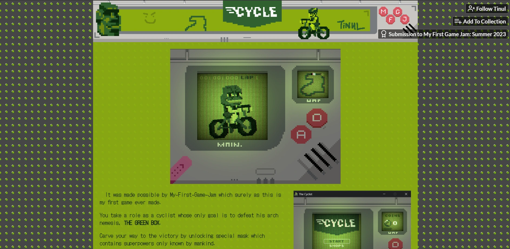

# ❓ What is it?

Cycle is a frantic, button-mashing bicycle racing game where the only thing between you and your doom... is your keyboard stamina. 🥵

You’re being chased — but there’s no time to think. Just pedal.
Mash your keys, outpace your fears, and maybe — just maybe — live to see another day on two wheels.

# ❤︎ Built With Love (and Godot)

This is my very first game project on GitHub, made with the open-source game engine [Godot](https://godotengine.org/). I challenged myself to build something simple, fun, and a little chaotic for [My First Game Jam: Summer 2023](https://itch.io/jam/my-first-game-jam-summer-2023/rate/2190820) — and Cycle was born!

- 🤖 Engine: Godot 3.x
- 🧱 Pixel Art + Dynamic Sound
- 🕹️ Button-mashing core mechanic
- 🟩 Enemies on wheels (box)

# 🧠 What I Learned

This project taught me a ton:
- 🔧 How to structure a Godot project in Git
- 🎮 Basics of animation, input handling, and game loops
- 🎪 Exporting and publishing to Itch.io for the first time