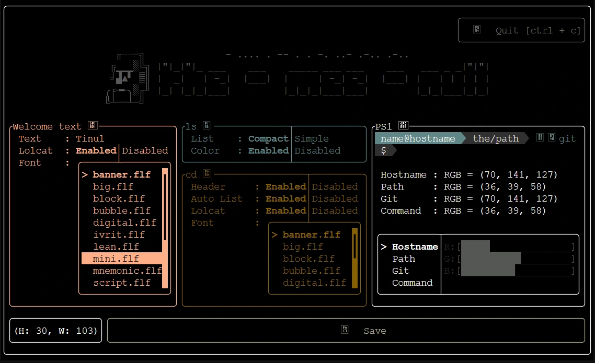

# ❓ What is it?

The-Mee-Null is a command-line glow-up machine. ✨
It transforms your basic terminal into a visually stunning, rainbow-blasted experience without spending hours tweaking your `.bashrc` or `.zshrc`.

Born from a desire to have a cool terminal setup without the hassle, this is a Terminal User Interface (TUI) app for anyone who loves aesthetics but also loves... being lazy. 😎

# 🎂 How it was born?

This is my first ever Terminal UI project, and one I'm super proud of! I built it using ftxui, a fantastic C++ library for building rich terminal interfaces.

- 👽 Uses figlet to render stylish ASCII banners
- 🌈 Adds lolcat for that colorful, rainbow terminal output
- ✨ Powered by ftxui for dynamic layout and interaction
- 🇨 Written entirely in C++ — outside the classroom, for real-world fun!

# 🧠 What I Learned?

This project opened a whole new world of TUI development:

- 🖐🏻 Hands-on C++ experience outside academia
- 💡 Understanding terminal rendering concepts with ftxui
- 💻 How to make CLIs not just functional, but delightful
- 🐧 Packaging and running apps on real Linux environments (Ubuntu, Pop!_OS)

# 👨 Give Your Terminal a Facelift

The-Mee-Null is easy to set up and super satisfying to use. You’ll need:

- 🐧 Ubuntu-based distro (for now)
- 🤓 Nerd Fonts installed
- 🌈 figlet + lolcat for maximum terminal flair

👉 Check it out on my [GitHub](https://github.com/fatinul/the-mee-null)
> Make your terminal pop, with minimal effort.